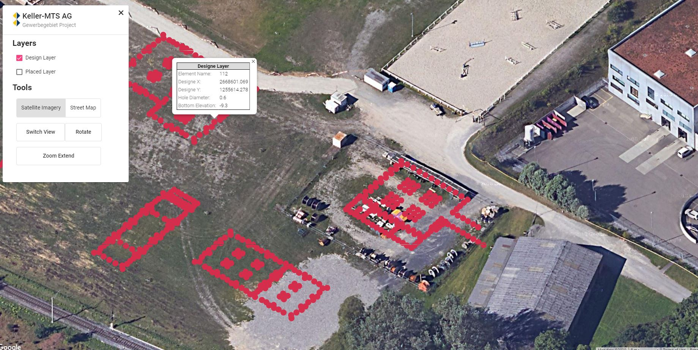

# Gewerbegebiet GIS

This project was generated with [Angular CLI](https://github.com/angular/angular-cli) version 9.1.1 along with [Google Maps](https://cloud.google.com/maps-platform/) version 3.4X, and [Angular Material](https://material.angular.io/) version 9.2.2. This project is a simple web-GIS application to show GeoJSON data provided by [GeoServer](http://geoserver.org/).

## Data

Since the GeoServer is a local server, We do not have acceess to the GeoJSON point map. It could be replaced with any URL. We need to add [Google Maps API Key](https://developers.google.com/maps/documentation/javascript/get-api-key) to index.html to load the base map in the production mode.

## App Preview Shot

